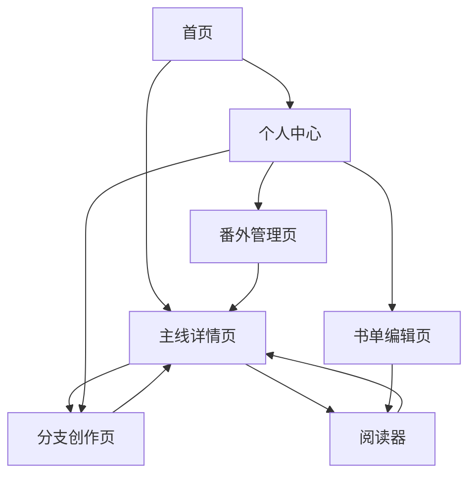

## 1. 产品概述

平行宇宙写作平台是一个创新型多人协作写作环境，采用"平行宇宙"概念实现多条故事线并行发展。平台支持主线、分支、番外和书单四种故事路径，为用户提供更加自由、创意和互动的写作体验。

该平台解决了传统写作平台线性叙事的局限性，让作者和读者能够探索故事的多种可能性，如同在平行宇宙中穿梭，每条故事线都能独立发展又相互关联。

## 2. 核心功能

### 2.1 用户角色

| 角色 | 注册方式 | 核心权限 |
|------|----------|----------|
| 普通读者 | 邮箱注册 | 浏览故事、创建书单、点赞评论、申请成为分支/番外作者 |
| 原作者 | 邮箱注册+身份认证 | 创建主线故事、发布官方分支、管理所有番外、查看全站统计数据 |
| 协作者 | 作者邀请/申请加入 | 参与特定故事线的协作、**独立发布故事分支和番外**（作为分支/番外作者） |
| 平台管理员 | 后台分配 | 内容审核、用户管理、系统配置、纠纷处理 |

### 2.2 核心概念扩展

平台支持两条并行的故事发展线路：
1. **官方主导线**：由原作者亲自创作或审核通过的"正史"，具有权威性。
2. **社区/协作者主导线**：由读者或协作者自发创作的"野史"或平行时空，展现故事的无限可能性。

### 2.2 功能模块

平台核心功能包含以下主要页面：

1. **首页**：故事推荐、热门主线、最新分支、个人创作入口
2. **主线详情页**：主线故事展示、分支树状图、章节阅读、创作分支
3. **分支创作页**：分支故事编辑、与主线关联设置、协作者邀请
4. **番外管理页**：番外故事列表、创作编辑、角色设定管理
5. **书单编辑页**：章节选择、阅读路线设计、书单发布分享
6. **个人中心**：我的创作、参与协作、收藏书单、数据统计
7. **阅读器**：多路径阅读体验、路径切换、阅读进度保存

### 2.3 页面详情

| 页面名称 | 模块名称 | 功能描述 |
|----------|----------|----------|
| 首页 | 故事推荐区 | 展示热门主线、编辑推荐、个性化推荐 |
| 首页 | 分类导航 | 按题材、进度、参与度筛选故事 |
| 首页 | 创作入口 | 快速创建主线、继续创作中的故事 |
| 主线详情页 | 故事信息 | 显示标题、作者、简介、标签、统计数据 |
| 主线详情页 | 分支树状图 | 可视化展示所有分支关系，支持交互探索 |
| 主线详情页 | 章节列表 | 按时间线展示章节，标识关键分支点 |
| 主线详情页 | 创作面板 | 在任意节点创建新分支或番外 |
| 分支创作页 | 编辑器 | 富文本编辑，支持插入图片、设定角色卡 |
| 分支创作页 | 关联设置 | 选择父节点、设置分支条件、影响范围 |
| 分支创作页 | 协作者管理 | 邀请其他作者、设置编辑权限 |
| 番外管理页 | 番外列表 | 展示所有番外，支持分类筛选 |
| 番外管理页 | 创作工具 | 独立番外编辑器，角色库引用 |
| 书单编辑页 | 章节选择器 | 从多条故事线中选择章节 |
| 书单编辑页 | 路线设计 | 拖拽排序、添加过渡说明、设置推荐语 |
| 个人中心 | 创作管理 | 查看和管理所有创作内容 |
| 个人中心 | 数据统计 | 阅读量、分支数、协作参与度等 |
| 阅读器 | 路径导航 | 显示当前路径，支持切换其他分支 |
| 阅读器 | 阅读工具 | 书签、笔记、分享、夜间模式 |

## 3. 核心流程

### 3.1 主线创作流程

作者创建主线故事 → 设置故事基本信息和标签 → 发布第一章节 → 读者阅读并提供反馈 → 作者继续创作或开放分支点 → 其他作者创建分支故事 → 形成故事树状结构

### 3.2 分支创作流程

选择分支起点（主线或其他分支）→ 创建分支故事（**可由协作者或读者申请发布**）→ 设置分支类型（官方/社区）→ 设置分支条件和影响范围 → 邀请协作者（可选）→ 发布分支章节 → 与原故事建立关联 → 更新整体故事树（**展示官方线与社区线两条路径**）

### 3.3 番外发布流程

选择角色或世界观节点 → 创作独立短篇故事 → 设置番外属性（官方/协作者独立发布）→ 关联主线故事 → 更新番外列表

### 3.3 书单创建流程

浏览感兴趣的故事 → 选择关键章节 → 设计阅读顺序 → 添加过渡说明和推荐语 → 设置书单属性（公开/私密）→ 发布分享 → 其他用户收藏阅读

### 3.4 多人协作流程

主线作者开放协作 → 邀请特定作者或公开招募 → 协作者申请加入 → 主线作者审核 → 分配编辑权限 → 协作者参与创作 → 内容审核和发布

## 4. 用户界面设计

### 4.1 设计风格

- **主色调**：深空蓝(#1a2332)搭配星云紫(#6366f1)，营造神秘的宇宙感
- **辅助色**：银白色(#f8fafc)用于背景，金色(#f59e0b)用于强调重要元素
- **按钮样式**：圆角矩形，主要按钮使用渐变背景，悬停时有微光效果
- **字体**：标题使用思源黑体，正文使用系统默认字体，确保阅读体验
- **布局风格**：卡片式布局，支持瀑布流展示故事封面
- **图标风格**：线性图标，使用宇宙、星空、分叉路径等主题元素

### 4.2 页面设计概述

| 页面名称 | 模块名称 | UI元素 |
|----------|----------|--------|
| 首页 | 故事推荐区 | 卡片式布局，每张故事卡片显示封面图、标题、作者、分支数量，悬停时有光晕效果 |
| 主线详情页 | 分支树状图 | 使用D3.js绘制交互式树状图，节点大小表示热度，颜色区分主线/分支/番外 |
| 分支创作页 | 编辑器 | 左侧编辑区支持富文本，右侧实时预览，顶部工具栏包含格式化和插入功能 |
| 阅读器 | 路径导航 | 顶部显示面包屑路径，支持点击跳转到任意节点，侧边栏展示可选分支 |
| 个人中心 | 创作管理 | 标签页切换不同内容类型，列表展示关键数据，支持批量操作 |

### 4.3 响应式设计

采用桌面端优先的设计策略，确保在1920x1080分辨率下有最佳体验。平板端适配采用响应式网格系统，手机端采用底部导航栏和折叠菜单。特别优化阅读器在移动设备上的体验，支持手势切换分支。

### 4.4 交互设计

- **分支探索**：用户可以通过点击树状图节点快速预览分支内容
- **路径切换**：阅读时可以通过侧边栏或手势快速切换到其他分支
- **协作邀请**：支持生成邀请链接或扫码加入协作
- **实时通知**：分支更新、协作邀请等重要消息通过WebSocket实时推送