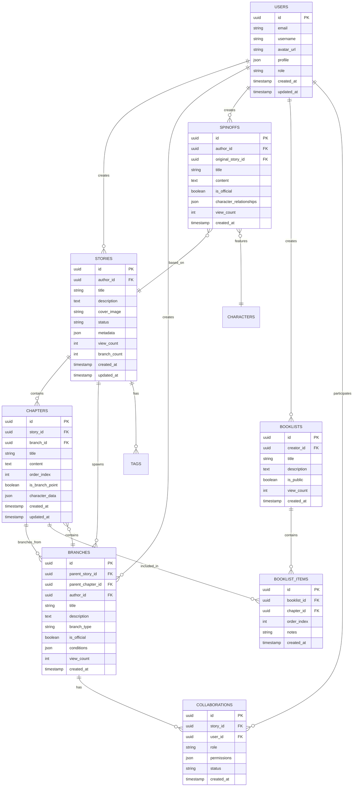

## 1. 架构设计

```mermaid
graph TD
    A[用户浏览器] --> B[React前端应用]
    B --> C[Node.js/Express后端服务]
    C --> D[SQLite本地数据库]
    C --> E[本地存储 (图片/文件)]
    B --> G[WebSocket实时通信]
    G --> C

    subgraph "前端层"
        B
    end

    subgraph "后端层"
        C
        D
        E
    end
```

## 2. 技术描述

- **前端**: React@18 + TypeScript@5 + TailwindCSS@3 + Vite
- **初始化工具**: vite-init
- **状态管理**: Zustand@4
- **UI组件库**: HeadlessUI + RadixUI
- **图表可视化**: D3.js@7 + React-Flow@11
- **富文本编辑器**: TipTap@2
- **后端**: Node.js + Express + TypeScript
- **数据库**: SQLite (本地存储)
- **ORM**: Prisma (支持 SQLite/PostgreSQL 迁移)
- **身份认证**: JWT + bcrypt
- **实时功能**: Socket.io

## 3. 路由定义

| 路由 | 用途 |
|------|------|
| / | 首页，展示故事推荐和热门内容 |
| /login | 登录页面，支持邮箱和社交账号登录 |
| /register | 注册页面，新用户注册 |
| /story/:id | 主线详情页，展示故事信息和分支树 |
| /story/:id/read | 阅读器页面，支持多路径阅读 |
| /story/:id/branch | 分支创作页面，创建新的故事分支 |
| /spinoff/:id | 番外详情页，展示独立短篇故事 |
| /booklist/create | 书单创建页面，自定义阅读路线 |
| /booklist/:id | 书单详情页，展示自定义阅读路线 |
| /profile | 个人中心，管理创作和收藏 |
| /profile/settings | 个人设置页面 |
| /dashboard | 作者工作台，数据统计和管理 |
| /collaborate/:id | 协作编辑页面，多人实时协作 |

## 4. 数据模型

### 4.1 数据模型定义



### 4.2 数据定义语言

```sql
-- 用户表
CREATE TABLE users (
    id UUID PRIMARY KEY DEFAULT gen_random_uuid(),
    email VARCHAR(255) UNIQUE NOT NULL,
    username VARCHAR(50) UNIQUE NOT NULL,
    password_hash VARCHAR(255) NOT NULL,
    avatar_url TEXT,
    profile JSONB DEFAULT '{}',
    role VARCHAR(20) DEFAULT 'reader' CHECK (role IN ('reader', 'author', 'admin')),
    created_at TIMESTAMP WITH TIME ZONE DEFAULT NOW(),
    updated_at TIMESTAMP WITH TIME ZONE DEFAULT NOW()
);

-- 故事表
CREATE TABLE stories (
    id UUID PRIMARY KEY DEFAULT gen_random_uuid(),
    author_id UUID REFERENCES users(id) ON DELETE CASCADE,
    title VARCHAR(200) NOT NULL,
    description TEXT,
    cover_image TEXT,
    status VARCHAR(20) DEFAULT 'ongoing' CHECK (status IN ('ongoing', 'completed', 'paused')),
    metadata JSONB DEFAULT '{}',
    view_count INTEGER DEFAULT 0,
    branch_count INTEGER DEFAULT 0,
    created_at TIMESTAMP WITH TIME ZONE DEFAULT NOW(),
    updated_at TIMESTAMP WITH TIME ZONE DEFAULT NOW()
);

-- 章节表
CREATE TABLE chapters (
    id UUID PRIMARY KEY DEFAULT gen_random_uuid(),
    story_id UUID REFERENCES stories(id) ON DELETE CASCADE,
    branch_id UUID REFERENCES branches(id) ON DELETE SET NULL,
    title VARCHAR(200) NOT NULL,
    content TEXT NOT NULL,
    order_index INTEGER NOT NULL,
    is_branch_point BOOLEAN DEFAULT FALSE,
    character_data JSONB DEFAULT '{}',
    created_at TIMESTAMP WITH TIME ZONE DEFAULT NOW(),
    updated_at TIMESTAMP WITH TIME ZONE DEFAULT NOW()
);

-- 分支表
CREATE TABLE branches (
    id UUID PRIMARY KEY DEFAULT gen_random_uuid(),
    parent_story_id UUID REFERENCES stories(id) ON DELETE CASCADE,
    parent_chapter_id UUID REFERENCES chapters(id) ON DELETE CASCADE,
    author_id UUID REFERENCES users(id) ON DELETE CASCADE,
    title VARCHAR(200) NOT NULL,
    description TEXT,
    branch_type VARCHAR(20) DEFAULT 'parallel' CHECK (branch_type IN ('parallel', 'alternate', 'whatif')),
    is_official BOOLEAN DEFAULT FALSE,
    conditions JSONB DEFAULT '{}',
    view_count INTEGER DEFAULT 0,
    created_at TIMESTAMP WITH TIME ZONE DEFAULT NOW()
);

-- 番外表
CREATE TABLE spinoffs (
    id UUID PRIMARY KEY DEFAULT gen_random_uuid(),
    author_id UUID REFERENCES users(id) ON DELETE CASCADE,
    original_story_id UUID REFERENCES stories(id) ON DELETE CASCADE,
    title VARCHAR(200) NOT NULL,
    content TEXT NOT NULL,
    is_official BOOLEAN DEFAULT FALSE,
    character_relationships JSONB DEFAULT '{}',
    view_count INTEGER DEFAULT 0,
    created_at TIMESTAMP WITH TIME ZONE DEFAULT NOW()
);

-- 书单表
CREATE TABLE booklists (
    id UUID PRIMARY KEY DEFAULT gen_random_uuid(),
    creator_id UUID REFERENCES users(id) ON DELETE CASCADE,
    title VARCHAR(200) NOT NULL,
    description TEXT,
    is_public BOOLEAN DEFAULT TRUE,
    view_count INTEGER DEFAULT 0,
    created_at TIMESTAMP WITH TIME ZONE DEFAULT NOW()
);

-- 书单项目表
CREATE TABLE booklist_items (
    id UUID PRIMARY KEY DEFAULT gen_random_uuid(),
    booklist_id UUID REFERENCES booklists(id) ON DELETE CASCADE,
    chapter_id UUID REFERENCES chapters(id) ON DELETE CASCADE,
    order_index INTEGER NOT NULL,
    notes TEXT,
    created_at TIMESTAMP WITH TIME ZONE DEFAULT NOW()
);

-- 协作表
CREATE TABLE collaborations (
    id UUID PRIMARY KEY DEFAULT gen_random_uuid(),
    story_id UUID REFERENCES stories(id) ON DELETE CASCADE,
    user_id UUID REFERENCES users(id) ON DELETE CASCADE,
    role VARCHAR(20) DEFAULT 'editor' CHECK (role IN ('editor', 'reviewer', 'admin')),
    permissions JSONB DEFAULT '{}',
    status VARCHAR(20) DEFAULT 'pending' CHECK (status IN ('pending', 'approved', 'rejected')),
    created_at TIMESTAMP WITH TIME ZONE DEFAULT NOW()
);

-- 创建索引
CREATE INDEX idx_stories_author_id ON stories(author_id);
CREATE INDEX idx_stories_created_at ON stories(created_at DESC);
CREATE INDEX idx_chapters_story_id ON chapters(story_id);
CREATE INDEX idx_chapters_order_index ON chapters(order_index);
CREATE INDEX idx_branches_parent_story_id ON branches(parent_story_id);
CREATE INDEX idx_branches_author_id ON branches(author_id);
CREATE INDEX idx_booklist_items_booklist_id ON booklist_items(booklist_id);
CREATE INDEX idx_collaborations_story_id ON collaborations(story_id);
CREATE INDEX idx_collaborations_user_id ON collaborations(user_id);

-- 设置权限
GRANT SELECT ON ALL TABLES TO anon;
GRANT ALL PRIVILEGES ON ALL TABLES TO authenticated;
GRANT USAGE ON ALL SEQUENCES TO authenticated;
```

## 5. 核心API设计

### 5.1 认证相关API

```typescript
// 用户注册
POST /api/auth/register
Request: {
  email: string;
  username: string;
  password: string;
  role?: 'reader' | 'author';
}
Response: {
  user: User;
  session: Session;
}

// 用户登录
POST /api/auth/login
Request: {
  email: string;
  password: string;
}
Response: {
  user: User;
  session: Session;
}

// 获取当前用户信息
GET /api/auth/me
Response: {
  user: User;
  permissions: string[];
}
```

### 5.2 故事管理API

```typescript
// 创建主线故事
POST /api/stories
Request: {
  title: string;
  description: string;
  cover_image?: string;
  tags?: string[];
}
Response: {
  story: Story;
}

// 获取故事详情
GET /api/stories/:id
Response: {
  story: Story;
  chapters: Chapter[];
  branches: Branch[];
  author: User;
}

// 更新故事信息
PUT /api/stories/:id
Request: {
  title?: string;
  description?: string;
  cover_image?: string;
  status?: 'ongoing' | 'completed' | 'paused';
}
Response: {
  story: Story;
}
```

### 5.3 分支管理API

```typescript
// 创建分支
POST /api/branches
Request: {
  parent_story_id: string;
  parent_chapter_id: string;
  title: string;
  description: string;
  branch_type: 'parallel' | 'alternate' | 'whatif';
  conditions?: Record<string, any>;
}
Response: {
  branch: Branch;
}

// 获取分支树结构
GET /api/stories/:id/branches/tree
Response: {
  tree: BranchNode;
  metadata: {
    total_branches: number;
    max_depth: number;
    popular_paths: string[];
  };
}

// 获取分支详情
GET /api/branches/:id
Response: {
  branch: Branch;
  chapters: Chapter[];
  author: User;
  parent_story: Story;
}
```

### 5.4 协作管理API

```typescript
// 发送协作邀请
POST /api/collaborations/invite
Request: {
  story_id: string;
  user_email: string;
  role: 'editor' | 'reviewer' | 'admin';
  permissions: {
    can_edit: boolean;
    can_publish: boolean;
    can_invite: boolean;
  };
}
Response: {
  invitation: Collaboration;
}

// 处理协作邀请
PUT /api/collaborations/:id/respond
Request: {
  status: 'approved' | 'rejected';
}
Response: {
  collaboration: Collaboration;
}

// 获取我的协作列表
GET /api/collaborations/my
Response: {
  collaborations: Collaboration[];
  stats: {
    total: number;
    active: number;
    pending: number;
  };
}
```

## 6. 实时协作架构

### 6.1 WebSocket连接管理

```typescript
// 协作房间管理
interface CollaborationRoom {
  storyId: string;
  chapterId: string;
  participants: User[];
  document: CollaborativeDocument;
  version: number;
}

// 操作同步
interface Operation {
  type: 'insert' | 'delete' | 'format';
  position: number;
  content?: string;
  attributes?: Record<string, any>;
  userId: string;
  timestamp: number;
}

// 冲突解决
interface ConflictResolution {
  strategy: 'last-write-wins' | 'operational-transform';
  merge: (local: Operation[], remote: Operation[]) => Operation[];
}
```

### 6.2 性能优化策略

- **分页加载**：故事列表采用虚拟滚动，只渲染可见区域
- **懒加载**：分支树按需展开，避免一次性加载大量数据
- **缓存策略**：使用React Query缓存频繁访问的数据
- **图片优化**：使用Next.js Image组件自动优化图片加载
- **CDN加速**：静态资源部署到全球CDN节点

## 7. 安全考虑

### 7.1 数据安全

- 使用Supabase的行级安全策略(RLS)控制数据访问
- 敏感数据加密存储
- 定期备份数据库
- 实施内容审核机制

### 7.2 用户隐私

- 遵循GDPR和用户隐私保护法规
- 提供数据导出和删除功能
- 匿名化用户统计数据
- 透明的隐私政策

### 7.3 内容安全

- 实施内容过滤和审核机制
- 用户举报和反馈系统
- 版权保护和原创内容验证
- 防止恶意脚本注入