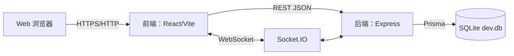
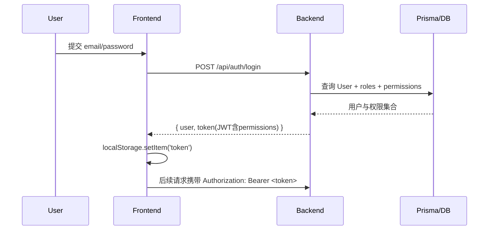
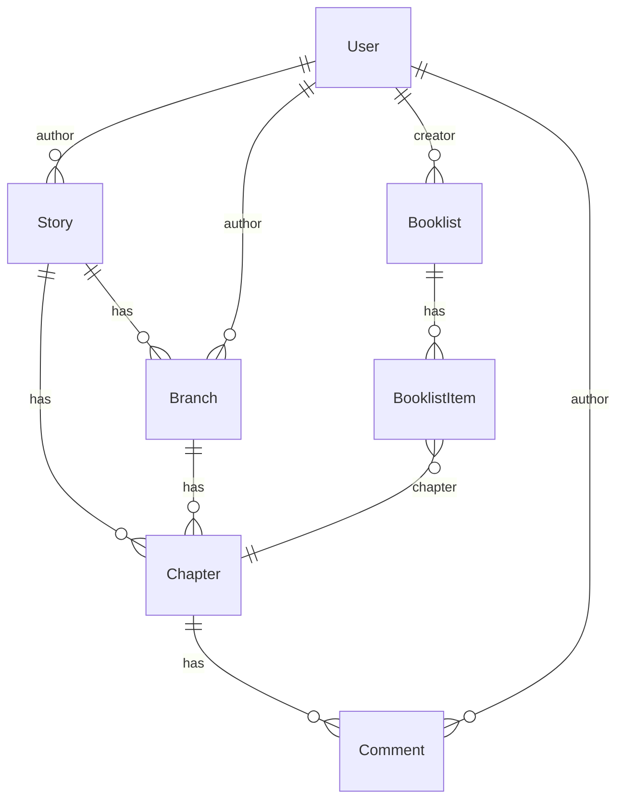
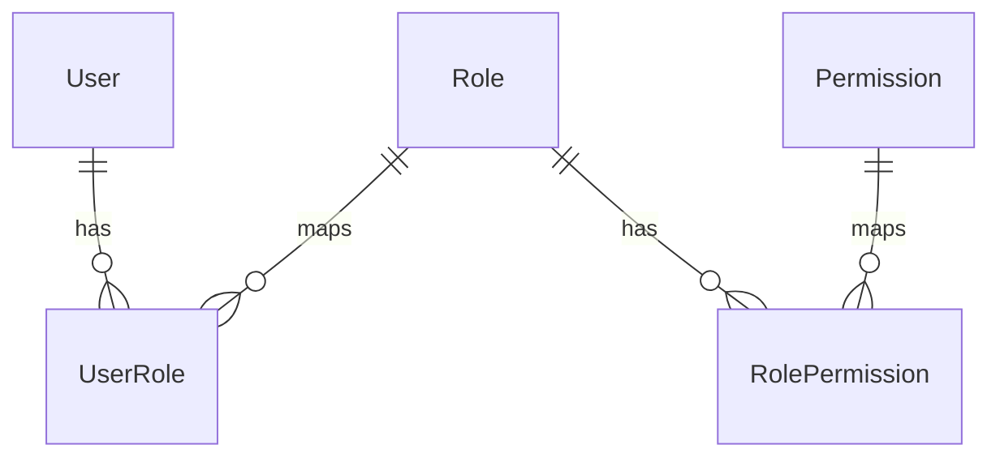

# XS 技术开发文档

> 适用范围：当前仓库（前端 + 后端 + Prisma/SQLite）。本文档以代码现状为准，面向新成员上手、日常开发协作与交付运维。  
> 格式：Markdown（含 Mermaid 图）。建议通过 PR 评审持续更新。

## 目录

- [1. 项目概览](#1-项目概览)
- [2. 架构设计](#2-架构设计)
  - [2.1 总体架构](#21-总体架构)
  - [2.2 关键数据流](#22-关键数据流)
- [3. 技术栈与依赖](#3-技术栈与依赖)
- [4. 代码结构与模块说明](#4-代码结构与模块说明)
  - [4.1 前端（src/）](#41-前端src)
  - [4.2 后端（api/src/）](#42-后端apisrc)
  - [4.3 数据库与 Prisma（prisma/）](#43-数据库与-prismaprisma)
- [5. 接口定义（HTTP API）](#5-接口定义http-api)
  - [5.1 认证与会话](#51-认证与会话)
  - [5.2 主线故事](#52-主线故事)
  - [5.3 章节](#53-章节)
  - [5.4 分支](#54-分支)
  - [5.5 书单](#55-书单)
  - [5.6 番外](#56-番外)
  - [5.7 RBAC 角色与权限](#57-rbac-角色与权限)
  - [5.8 健康检查](#58-健康检查)
- [6. 数据库设计](#6-数据库设计)
  - [6.1 关键实体关系](#61-关键实体关系)
  - [6.2 RBAC 模型](#62-rbac-模型)
  - [6.3 迁移与种子数据](#63-迁移与种子数据)
- [7. 环境配置](#7-环境配置)
- [8. 本地开发流程](#8-本地开发流程)
- [9. 部署流程](#9-部署流程)
- [10. 编码规范](#10-编码规范)
- [11. 测试策略](#11-测试策略)
- [12. 性能指标与优化建议](#12-性能指标与优化建议)
- [13. 安全要求](#13-安全要求)
- [14. 运维与监控](#14-运维与监控)
- [15. 版本控制与协作流程](#15-版本控制与协作流程)

---

## 1. 项目概览

XS 是一个“主线故事 + 平行分支 + 番外 + 书单（阅读路线）”的创作与阅读平台。核心能力包括：

- 主线故事（Story）创作与展示
- 章节（Chapter）阅读与评论（Comment）
- 分支（Branch）在“分支点章节”处展开并形成树状结构
- 书单（Booklist）作为“章节阅读路线”，支持编排与推荐
- 认证（JWT）与基于 RBAC 的权限控制（Permission）
- 预留实时协作通道（Socket.IO）

前端运行在 `http://localhost:5173`，后端 API 运行在 `http://localhost:3001/api`（默认）。

## 2. 架构设计

### 2.1 总体架构



关键入口文件：

- 前端路由与 Provider：[App.tsx](file:///h:/xs/src/App.tsx)
- 前端 API Client（Axios + token 注入）：[client.ts](file:///h:/xs/src/api/client.ts)
- 后端入口（Express + 路由挂载 + Socket.IO）：[index.ts](file:///h:/xs/api/src/index.ts)
- 数据模型：[schema.prisma](file:///h:/xs/prisma/schema.prisma)

### 2.2 关键数据流

#### 登录与权限下发



#### 个人中心（Dashboard）数据聚合

Dashboard 当前通过 React Query 轮询拉取“我的主线/我的分支/我的番外/我的书单”等数据（每 5 秒），以减少手动刷新与数据滞后。

参考实现：[DashboardPage.tsx](file:///h:/xs/src/pages/DashboardPage.tsx)

## 3. 技术栈与依赖

以 [package.json](file:///h:/xs/package.json) 为准：

- 前端：React 18、TypeScript、Vite、Tailwind CSS
- 路由：react-router-dom
- 状态：Zustand（用户态、故事态）
- 数据请求：Axios + TanStack Query（缓存/轮询/失效）
- 动画与可视化：framer-motion、reactflow、d3
- 编辑器：TipTap
- 后端：Express、Socket.IO、Helmet、CORS、dotenv
- 认证：jsonwebtoken、bcryptjs
- ORM：Prisma（SQLite datasource）
- 测试：Vitest + Testing Library + JSDOM

## 4. 代码结构与模块说明

### 4.1 前端（src/）

- `src/App.tsx`：路由表、React Query Provider、鉴权初始化（`checkAuth()`）
- `src/layouts/MainLayout.tsx`：全局布局（顶部/侧边/Outlet）
- `src/pages/`：页面级组件
  - `DashboardPage.tsx`：个人中心（我的主线/分支/番外/书单）
  - `mainline/`：主线详情、创建主线、角色管理等
  - `branch/`：分支详情
  - `read/`：阅读页与评论
  - `booklist/`：书单列表与书单详情
  - `admin/RoleManagement.tsx`：角色权限管理（受 PermissionGate 控制）
  - `auth/`：登录/注册
- `src/api/`：API 调用封装
  - `client.ts`：Axios client + token 注入
  - `authService.ts`：登录/注册/我是谁
  - `storyService.ts`：stories/chapters/branches/spinoffs/booklists 等
- `src/stores/`：Zustand store（如 `useAuthStore`）
- `src/components/`：通用组件（Modal、PermissionGate、StoryTree、编辑器等）

### 4.2 后端（api/src/）

- `api/src/index.ts`：服务入口，挂载路由、Socket.IO、错误处理中间件、health check
- `api/src/routes/`：路由定义（按域拆分）
- `api/src/controllers/`：控制器（业务逻辑 + Prisma 调用）
- `api/src/middleware/auth.ts`：JWT 认证与权限校验（`authenticate`/`requirePermission`）

### 4.3 数据库与 Prisma（prisma/）

- `schema.prisma`：模型定义（User/Story/Chapter/Branch/Booklist/RBAC 等）
- `migrations/`：迁移记录
- `seed.ts`：业务初始数据
- `seed_rbac.ts`：RBAC 初始化数据（角色、权限、关系）

## 5. 接口定义（HTTP API）

> baseURL：`http://localhost:3001/api`（见 [client.ts](file:///h:/xs/src/api/client.ts)）

### 5.1 认证与会话

路由挂载：`/api/auth`（见 [api/src/index.ts](file:///h:/xs/api/src/index.ts#L38-L46)）

- `POST /auth/register`：注册
- `POST /auth/login`：登录（返回 JWT，payload 含 permissions）
- `GET /auth/me`：获取当前登录用户信息（需要 Authorization）

实现参考：[authController.ts](file:///h:/xs/api/src/controllers/authController.ts)

### 5.2 主线故事

路由：[/api/src/routes/stories.ts](file:///h:/xs/api/src/routes/stories.ts)

- `GET /stories`：故事列表（可按 tag 过滤）
- `GET /stories/:id`：故事详情（含 chapters、branches、tags、author）
- `POST /stories`：创建故事（需要登录）
- `PUT /stories/:id`：更新故事（作者或 admin）
- `DELETE /stories/:id`：删除故事（作者或 admin）
- `GET /stories/my`：我的主线（需要登录）
- `GET /stories/recent`：最近阅读（需要登录）
- `GET /stories/tags`：热门标签

### 5.3 章节

路由：`/api/chapters`（见 [api/src/index.ts](file:///h:/xs/api/src/index.ts#L38-L46)）

典型能力：章节详情、创建、更新、评论。

### 5.4 分支

路由：`/api/branches`

典型能力：创建分支、分支详情、我的分支等。

### 5.5 书单

路由：[/api/src/routes/booklists.ts](file:///h:/xs/api/src/routes/booklists.ts)

- `GET /booklists`：公开书单列表
- `GET /booklists/:id`：书单详情（含 items + chapter + story.author）
- `GET /booklists/my`：我的书单（需要登录）
- `POST /booklists`：创建书单（需要登录）
- `PUT /booklists/:id`：更新书单（需要登录）
- `POST /booklists/:id/items`：向书单追加章节（需要登录）

### 5.6 番外

路由：`/api/spinoffs`

典型能力：列表、我的番外、创建番外等。

### 5.7 RBAC 角色与权限

路由：`/api/roles`

典型能力：角色 CRUD、为角色分配权限；前端通过 `PermissionGate` 控制管理页入口与操作按钮。

### 5.8 健康检查

- `GET /health`：返回服务状态与数据库类型（SQLite）  
  见 [api/src/index.ts](file:///h:/xs/api/src/index.ts#L47-L50)

## 6. 数据库设计

### 6.1 关键实体关系

核心关系见 [schema.prisma](file:///h:/xs/prisma/schema.prisma)：



### 6.2 RBAC 模型



### 6.3 迁移与种子数据

- Prisma schema：[/prisma/schema.prisma](file:///h:/xs/prisma/schema.prisma)
- 迁移：[/prisma/migrations/](file:///h:/xs/prisma/migrations)
- Seed：
  - 业务 seed：[/prisma/seed.ts](file:///h:/xs/prisma/seed.ts)
  - RBAC seed：[/prisma/seed_rbac.ts](file:///h:/xs/prisma/seed_rbac.ts)

## 7. 环境配置

环境变量文件：`.env`（本地开发用；生产环境请走平台配置）

常用变量（以代码读取为准）：

- `DATABASE_URL`：Prisma 连接串（SQLite）
- `JWT_SECRET`：JWT 签名密钥（见 [auth.ts](file:///h:/xs/api/src/middleware/auth.ts#L1-L7) 与 [authController.ts](file:///h:/xs/api/src/controllers/authController.ts#L1-L8)）
- `PORT`：后端端口（默认 3001，见 [api/src/index.ts](file:///h:/xs/api/src/index.ts#L29-L31)）

## 8. 本地开发流程

> 以下命令以根目录为工作目录（`h:\xs`）。

```bash
npm install
```

数据库：

```bash
npx prisma migrate dev
npx prisma db seed
```

启动（推荐）：

```bash
npm run dev:full
```

分别启动：

```bash
npm run server
npm run dev
```

## 9. 部署流程

当前仓库包含 Vercel 配置（见 [.vercel/project.json](file:///h:/xs/.vercel/project.json)）。建议明确“前端静态托管 + 后端 API 独立部署”或“同平台一体化”策略：

- 前端：Vite build 输出静态资源
- 后端：Node 服务（Express + Socket.IO）需要长连接支持
- 数据库：开发使用 SQLite；生产建议迁移到 Postgres（仓库存在 [supabase/migrations](file:///h:/xs/supabase/migrations) 线索，可作为未来迁移参考）

## 10. 编码规范

### TypeScript/React

- 组件优先函数组件
- 避免在渲染路径中直接访问不保证存在的深层字段（使用可选链或后端补齐字段）
- 全局状态（用户态）放在 Zustand；异步数据使用 React Query 管理缓存与失效

### 后端

- 路由与控制器分层：`routes/` 只负责 HTTP 定义，`controllers/` 负责业务逻辑
- Prisma 查询在 controller 里集中处理
- 任何需要登录的接口统一通过 `authenticate` 中间件
- 权限控制通过 `requirePermission('xxx')` 或 `authorize(['role'])`

Lint 与类型检查：

- ESLint 配置：[eslint.config.js](file:///h:/xs/eslint.config.js)
- TS config：根 [tsconfig.json](file:///h:/xs/tsconfig.json) 与 [api/tsconfig.json](file:///h:/xs/api/tsconfig.json)

## 11. 测试策略

### 单元测试

- 运行：`npm test`（Vitest）
- 测试框架：Vitest + @testing-library/react + jsdom（配置见 [vitest.config.ts](file:///h:/xs/vitest.config.ts) 与 [setup.ts](file:///h:/xs/src/test/setup.ts)）
- 覆盖方向：
  - Store：`useAuthStore` 会话恢复、错误处理
  - 页面关键交互：Mainline、Dashboard、BooklistDetail 渲染与兜底

### 端到端（E2E）

当前仓库尚未引入 Playwright/Cypress。建议选型其一并纳入 CI：

- 场景：登录、创建主线、进入个人中心验证“我的主线”、打开书单详情验证渲染、断网/恢复验证提示与降级

## 12. 性能指标与优化建议

现状：

- Dashboard 采用 5 秒轮询更新用户数据（见 [DashboardPage.tsx](file:///h:/xs/src/pages/DashboardPage.tsx)）

建议指标（落地到监控/埋点）：

- 端到端接口延迟（p50/p95）
- 轮询/重试次数（React Query 内部重试关闭或降级策略）
- 前端内存占用（长时间停留 Dashboard/阅读页）
- CPU 增量：轮询与渲染应保持低频 diff，避免频繁 setState

优化方向：

- 对高频变化模块优先用 SSE/WebSocket 推送替代轮询（但需考虑鉴权与断线重连）
- React Query：按页面可见性/焦点切换策略调整 `refetchOnWindowFocus` 等参数

## 13. 安全要求

### JWT 与密钥

- 必须在生产环境设置强 `JWT_SECRET`，禁止使用默认值（当前代码存在默认回退值）
- Token 存储：当前在前端使用 `localStorage`，需评估 XSS 风险；若要更高安全性，可迁移到 HttpOnly Cookie（代价：CSRF、防跨域配置等）

### CORS/Helmet

- 当前 Socket.IO 配置 `origin: '*'` 仅适合本地（见 [api/src/index.ts](file:///h:/xs/api/src/index.ts#L22-L27)）
- Helmet CSP 在本地关闭；生产应开启并配置白名单（见 [api/src/index.ts](file:///h:/xs/api/src/index.ts#L32-L35)）

### 权限控制

- 接口层：使用 `authenticate` 与 `requirePermission`
- 前端层：`PermissionGate` 仅用于 UI 隐藏，不等同于安全；后端必须做最终授权

## 14. 运维与监控

建议引入：

- 服务健康：`GET /api/health`
- 结构化日志：请求日志（method/path/status/latency/requestId）
- 指标：Prometheus/OpenTelemetry（请求耗时、错误率、WebSocket 连接数）
- 报警：p95 延迟、5xx 错误率、数据库错误、JWT 校验失败异常增长

## 15. 版本控制与协作流程

建议采用：

- 分支策略：`main`（稳定）+ `feature/*` + `fix/*`
- 变更流程：PR 必须包含：
  - 变更说明（为什么改/怎么改）
  - 影响面与回归点
  - 对应测试（单测/E2E）
  - 文档更新（本文档章节交叉引用）
- 评审重点：权限与安全、数据结构兼容性（后端返回字段）、前端空值兜底、性能影响

